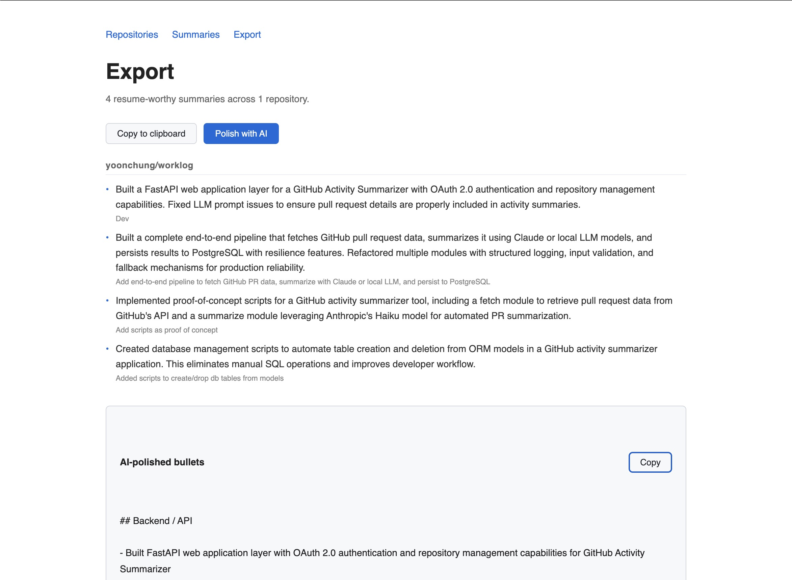

# WorkLog

WorkLog turns your GitHub pull request history into resume-ready bullet points.

## The problem

After a few years of engineering work, it's hard to remember what you actually built. Your GitHub history has the raw material — merged PRs, commit messages, code diffs — but it takes real effort to translate that into something you can put on a resume. Most engineers either skip this work entirely or write vague bullets like "contributed to backend services."

WorkLog automates the translation. It reads your merged PRs, sends each one to Claude with context about the code changes and commit messages, and generates a structured summary. You flag the ones worth keeping, add notes where GitHub doesn't tell the full story, and export polished bullet points ready to paste into a resume or LinkedIn.

## What it does

1. **Connect a repository** — authenticate with GitHub OAuth, add any repo you have access to
2. **Sync** — fetches all merged PRs and sends each to Claude for summarization
3. **Review** — read each summary, star the resume-worthy ones, add private notes
4. **Export** — copy the flagged bullets to clipboard, or hit "Polish with AI" to have Claude regroup them by theme and rewrite with stronger action verbs



## Running locally

**Prerequisites:** Python 3.11+, PostgreSQL

**1. Clone and install**
```bash
git clone https://github.com/yoonchung/worklog
cd worklog
python3 -m venv .venv && source .venv/bin/activate
pip install -r requirements.txt
```

**2. Create a GitHub OAuth app**

Go to [github.com/settings/developers](https://github.com/settings/developers) → New OAuth App. Set the callback URL to `http://localhost:8000/auth/callback`.

**3. Configure environment**

Create a `.env` file:
```
ANTHROPIC_API_KEY=...

GITHUB_CLIENT_ID=...
GITHUB_CLIENT_SECRET=...
GITHUB_REDIRECT_URI=http://localhost:8000/auth/callback

SESSION_SECRET_KEY=any-long-random-string
FERNET_KEY=...  # generate with the command below
```

Generate a Fernet key:
```bash
python3 -c "from cryptography.fernet import Fernet; print(Fernet.generate_key().decode())"
```

**4. Set up the database**
```bash
createdb worklog_db
python3 scripts/db_create_tables.py
```

**5. Run**
```bash
uvicorn app.main:app --reload
```

Open [http://localhost:8000](http://localhost:8000).

## Architecture

```
app/
  auth.py         — GitHub OAuth flow, session cookies, token encryption
  repos.py        — Repository CRUD + sync trigger
  summaries.py    — Summary list + inline PATCH for flags and notes
  export.py       — Filtered export view + AI polish endpoint
  sync.py         — Pipeline: fetch PRs → summarize → persist to DB
scripts/
  fetch.py        — GitHub API (PyGithub): fetches merged PRs, extracts metadata
  summarize.py    — Anthropic API: builds prompts, calls Claude, parses JSON
  run_pipeline.py — CLI orchestrator (fetch + summarize + DB write)
```

**A few decisions worth noting:**

**Sync runs in a thread, not async.** The sync endpoint is a regular `def` function, not `async def`. FastAPI automatically runs sync endpoints in a threadpool. This is intentional — PyGithub and the Anthropic SDK are synchronous blocking I/O. Making them async would require switching to httpx + the async Anthropic client and rewriting the pipeline scripts. The threadpool approach lets the web app reuse the existing CLI pipeline code without modification.

**Per-PR savepoints.** The sync pipeline wraps each PR's DB write in `session.begin_nested()`, which maps to a PostgreSQL savepoint. If one PR fails (e.g., the LLM returns malformed JSON), only that PR is rolled back — the rest of the sync proceeds. Without savepoints, any single failure would abort the entire sync session.

**`timestamptz` everywhere.** All datetime columns use `DateTime(timezone=True)` (PostgreSQL `TIMESTAMP WITH TIME ZONE`). The naive alternative (`TIMESTAMP WITHOUT TIME ZONE`) caused a real bug: psycopg2 silently converts timezone-aware datetimes to local time on write, so a sync timestamp written at UTC midnight would be read back as 17:00 local time (PDT), making the 1-hour cooldown guard compare UTC against local time and fire immediately instead of blocking.

**Fernet for token storage.** GitHub access tokens are encrypted with Fernet symmetric encryption before being stored in the database. The key lives in the environment, not the DB. This means a database leak doesn't expose live GitHub tokens.

**Session cookies, not JWTs.** Signed session cookies (itsdangerous `URLSafeTimedSerializer`) rather than JWTs. JWTs require token revocation infrastructure to invalidate on logout; signed cookies with a server-side secret can be invalidated simply by rotating the secret. For a single-server app, the tradeoff is straightforward.

## CLI usage

The pipeline also runs as a standalone CLI without the web app:

```bash
# Full pipeline — fetch, summarize, save to DB
python3 scripts/run_pipeline.py owner/repo

# Fetch only — writes pull_requests.json
python3 scripts/fetch.py owner/repo

# Summarize only — reads pull_requests.json, writes summaries.json
python3 scripts/summarize.py
```

The CLI requires `GITHUB_TOKEN` and `ANTHROPIC_API_KEY` in `.env`. It supports a local LLM (e.g. LM Studio) via `LOCAL_BASE_URL` + `LOCAL_API_KEY`.
